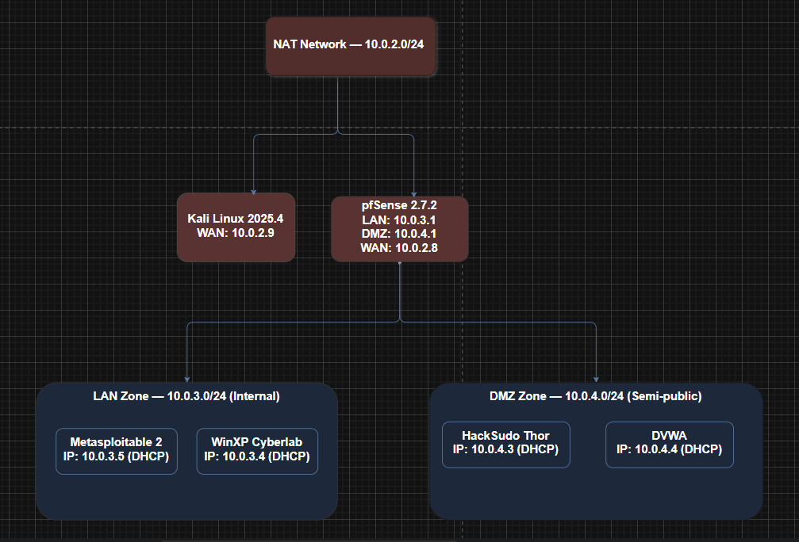
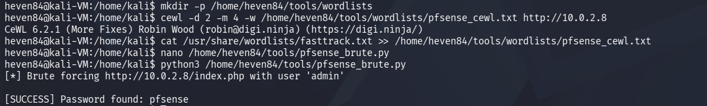
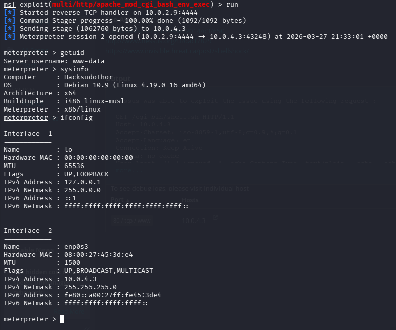
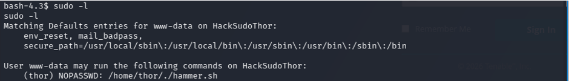
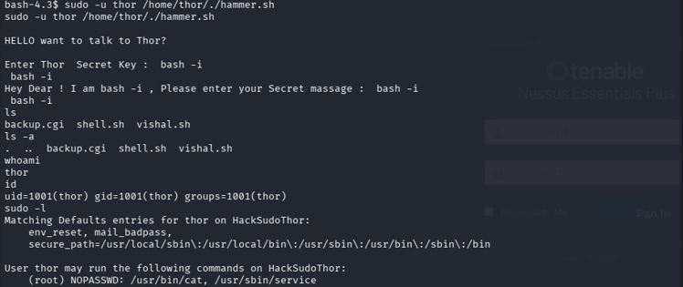
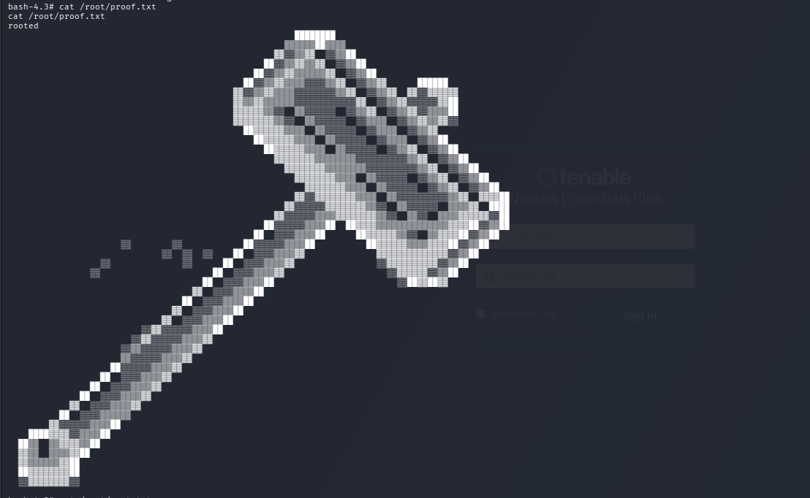
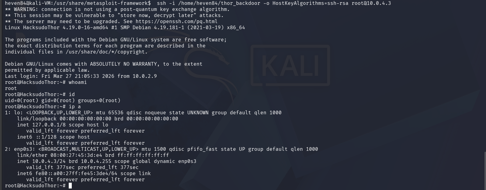

# HackSudo Thor Full Penetration Testing Walkthrough

> **Target:** [HackSudo Thor](https://www.vulnhub.com/entry/hacksudo-thor,733/) from VulnHub  
> **Objective:** Gain root access and read `/root/proof.txt`  
> **Environment:** Isolated VirtualBox lab segmented by a pfSense firewall  

## Table of Contents

- [Overview](#overview)
- [Network Topology](#network-topology)
- [Attack Chain Summary](#attack-chain-summary)
- [Phase 1: Passive Reconnaissance](#phase-1-passive-reconnaissance)
- [Phase 2: Network Discovery and pfSense](#phase-2-network-discovery-and-pfsense)
- [Phase 3: Target Scanning and Enumeration](#phase-3-target-scanning-and-enumeration)
- [Phase 4: Vulnerability Assessment](#phase-4-vulnerability-assessment)
- [Phase 5: Gaining Access](#phase-5-gaining-access)
- [Phase 6: Privilege Escalation](#phase-6-privilege-escalation)
- [Phase 7: Post-Exploitation](#phase-7-post-exploitation)
- [Phase 8: Tracks Covering](#phase-8-tracks-covering)
- [Vulnerabilities Exploited](#vulnerabilities-exploited)
- [Tools Used](#tools-used)
- [Recommendations](#recommendations)
- [Repository Structure](#repository-structure)
- [Ethical Disclaimer](#ethical-disclaimer)


## Overview

This repository documents a partial black-box penetration test conducted on **HackSudo Thor**, an intentionally vulnerable virtual machine published on VulnHub by Vishal Waghmare. The goal was to simulate a real-world attack where an outside attacker attempts to compromise an isolated internal system  with the primary objective being to gain root access and read the contents of `/root/proof.txt`.

The assessment follows the full penetration testing lifecycle: passive reconnaissance, network discovery, enumeration, vulnerability assessment, exploitation, privilege escalation, post-exploitation, and track covering. 

The primary tools used were Nmap for network scanning, Nessus for vulnerability assessment, and the Metasploit Framework as the main exploitation and post-exploitation platform. John the Ripper, Hashcat, and online Rainbow Tables were used during the password cracking stage, though all attempts were ultimately unsuccessful due to the strength of the hashing algorithm in use.


## Network Topology

The virtual lab was built entirely in VirtualBox and designed to simulate a realistic enterprise network with three distinct security zones, all managed by a pfSense 2.7.2 firewall. The three NAT networks were configured as follows: a WAN zone simulating the public internet where the Kali attacker machine lives, a DMZ zone hosting the target machine, and an internal LAN zone containing out-of-scope machines.

```
Internet Zone — NatNetwork (10.0.2.0/24)
│
│   Kali Linux 2025.4 [attacker]    — 10.0.2.9
│   pfSense WAN interface           — 10.0.2.8
│
├── pfSense Firewall (boundary device)
│
├── DMZ Zone — DMZnat (10.0.4.0/24)
│   ├── HackSudo Thor [TARGET]      — 10.0.4.3
│   └── DVWA                        — 10.0.4.4   (out of scope)
│
└── LAN Zone — LANnat (10.0.3.0/24)
    ├── Metasploitable 2             — 10.0.3.5   (out of scope)
    └── Windows XP Cyberlab          — 10.0.3.4   (out of scope)
```


*Logical network topology security zones managed by pfSense*

The WAN interface was assigned `10.0.2.8/24` by DHCP, the LAN interface was set to `10.0.3.1/24`, and the OPT1 (DMZ) interface was set to `10.0.4.1/24`. To introduce a deliberate misconfiguration into the lab, port 80 was intentionally left exposed on the pfSense WAN interface, simulating a common real-world admin panel exposure that served as the primary entry point into the internal network.

---

## Attack Chain Summary

```
[Kali Linux — 10.0.2.9]
        │
        │  CSRF-aware Python brute force → admin / pfsense
        ▼
[pfSense webConfigurator — 10.0.2.8:80]
        │
        │  Firewall rules disabled → DMZ and LAN now reachable
        ▼
[HackSudo Thor — 10.0.4.3]
        │
        │  Shellshock RCE (CVE-2014-6271)
        │  Apache mod_cgi → /cgi-bin/shell.sh
        ▼
[Meterpreter shell — www-data]
        │
        │  sudo -u thor /home/thor/hammer.sh
        │  Command injection via eval → bash -i payload
        ▼
[Interactive shell — thor]
        │
        │  GTFOBins: sudo service ../../bin/bash
        ▼
[Root shell]
        │
        ├── /root/proof.txt captured        ✅
        ├── /etc/shadow + /etc/passwd exfiltrated
        └── SSH RSA backdoor planted
```


## Phase 1: Passive Reconnaissance

Before making any contact with the target environment, information was gathered exclusively from public sources. The two primary sources were the official VulnHub entry page for HackSudo Thor and the author's public GitHub profile.

The VulnHub page confirmed the target was a Linux-based system, rated easy to medium difficulty, with the objective of finding the `proof.txt` flag. Reviewing the author's GitHub profile gave additional insight. Vishal Waghmare consistently designs Linux boot-to-root machines with privilege escalation as the core challenge across the entire HackSudo series. This shaped the threat model going into the active phases: HTTP and SSH services were the most likely attack surface, and the escalation path was predicted to involve sudo misconfiguration, SUID binary abuse, or exploitation of a custom service.

This kind of author pattern analysis matters in a real engagement too. Understanding how a system was likely designed and what categories of weakness its administrator is likely to repeat gives direction before a single packet is sent.

| Field | Detail |
|-------|--------|
| Target | HackSudo Thor |
| Author | Vishal Waghmare (@hacksudo) |
| Release | 3 August 2021 |
| Difficulty | Easy to Medium |
| OS | Linux (Debian) |
| Format | VirtualBox OVA |
| DHCP | Enabled |
| Predicted Attack Surface | HTTP, SSH, sudo misconfiguration likely |

---

## Phase 2: Network Discovery and pfSense

This phase involved making direct active contact with the environment. The objective was to identify all live hosts, understand the network boundary, and build a picture of the full attack surface before narrowing focus to the primary target.

### Finding the Boundary Device

A lightweight Nmap ping sweep (`-sn`) was first run against the WAN subnet (`10.0.2.0/24`) to discover live hosts with minimal noise. Three hosts were identified:  `10.0.2.1` and `10.0.2.2` were standard VirtualBox infrastructure addresses, which left `10.0.2.8` as the only non-infrastructure host. That machine became the immediate focus.

A full SYN stealth scan against `10.0.2.8` returned no results at all. This was expected behaviour rather than an error. Enterprise firewalls are designed to be unresponsive to port scanning, silently dropping packets rather than replying. The absence of results was itself confirmation that this was a network boundary device actively filtering traffic.

To confirm what services were actually running without relying on packet scanning, a direct HTTP request was issued using curl. This approach was taken because a standard web request is far less likely to be filtered than a scanning tool. The response came back as `HTTP/1.1 200 OK` with `Server: nginx` and a page title of `pfSense`,  confirming that the webConfigurator was directly accessible on port 80 from the WAN interface.

### Bypassing CSRF to Brute Force pfSense

With the login page confirmed, the next step was attempting to recover credentials. Hydra was initially selected as the brute force tool, but this attempt failed for two reasons. The first was a practical `rockyou.txt` that contains over 14 million entries, making it impractical within the timeframe of this assessment. The second was technical and more significant: pfSense 2.7.2 implements CSRF token protection, generating a unique cryptographic token on every page load that must be submitted alongside the credentials. Hydra's HTTP POST module submits a static request body and has no mechanism to dynamically fetch a fresh token per attempt, so every submission was rejected before the password was even checked.

To work around this, a custom Python script was written to replicate the full browser login process. For each password attempt, the script opens a new session, loads the login page, extracts the current CSRF token from the HTML form, and then submits the credentials alongside that token exactly as a browser would. A custom wordlist was built using CeWL to crawl the pfSense login page and extract relevant terms, then supplemented with `fasttrack.txt` to cover known default credentials.

The script recovered the credentials: **`admin / pfsense`**,  the unchanged default.


*Custom Python script recovering pfSense credentials*

### Mapping the Internal Network

With dashboard access established, the pfSense interface configuration was reviewed to understand the full internal topology. This revealed two subnets that had been invisible from the WAN: a LAN at `10.0.3.0/24` and a DMZ at `10.0.4.0/24`. The WAN firewall rules were then disabled through the web interface, and two pass rules were added to allow traffic from the attacker's IP into both subnets.

Nmap ping sweeps across both subnets identified six live hosts. Four of them were enumerated further,  excluding `10.0.4.1` and `10.0.3.1`, which belonged to the pfSense gateway interfaces. A combined service enumeration scan with version detection, default NSE scripts, and OS fingerprinting was run against all four simultaneously. Cross-referencing the results against the passive reconnaissance identified every machine in the topology:

| IP Address | Key Services | OS | Identified As |
|------------|-------------|-----|---------------|
| 10.0.4.3 | SSH 7.9p1, Apache 2.4.38, FTP | Linux (Debian) | **HackSudo Thor** |
| 10.0.4.4 | Apache 2.4.29, DVWA v1.10 | Linux (Ubuntu) | DVWA |
| 10.0.3.4 | Microsoft IIS 5.1 | Windows XP/2003 | WinXP Cyberlab |
| 10.0.3.5 | vsftpd 2.3.4, SSH, Apache 2.2.8 | Linux (Ubuntu) | Metasploitable 2 |

The target was confirmed as `10.0.4.3`. All further activity was focused exclusively on this machine.

---

## Phase 3: Target Scanning and Enumeration

With the target identified, a deeper analysis of its services was performed to map the attack surface and determine viable exploitation paths. The Metasploit Framework was used as the primary platform for this phase, specifically because its PostgreSQL backend persists all scan results across sessions,  hosts, services, and vulnerabilities, which are all stored in the database and available to reference during later phases without re-scanning.

Before beginning, Metasploit was initialised with `msfdb init`, the database connection was verified with `db_status`, and all subsequent work was conducted from within the `msfconsole`.

The `db_nmap` command was used to run a full scan against `10.0.4.3` SYN stealth scan, service version detection, default NSE scripts, OS fingerprinting, and all 65,535 TCP ports. Results were stored automatically in the database and retrieved with `hosts` and `services`. Three services were confirmed open: FTP on port 21 running Pure-FTPd, SSH on port 22 running OpenSSH 7.9p1, and HTTP on port 80 running Apache 2.4.38.

Each service was then enumerated further using targeted Metasploit auxiliary modules. The HTTP service received the most attention. The `dir_scanner` and `http_crawler` modules were used to map all accessible paths and endpoints on the web server. The most significant finding from this was the `/cgi-bin/` directory and a script named `shell.sh`. Separately, a manual review of the HTML source code of `news.php` revealed a hidden comment from the author referencing the `/cgi-bin/` directory, a deliberate hint pointing toward a CGI-based vulnerability. The FTP service was checked for anonymous access (disabled), and the version string was noted for CVE cross-referencing. The SSH banner was retrieved for the same purpose.


## Phase 4: Vulnerability Assessment

With the attack surface fully mapped, a structured vulnerability assessment was performed using two approaches: an automated Nessus scan and manual attacker reasoning applied to each service.

A custom Nessus policy was created with CGI scanning and web application testing explicitly enabled, targeting ports 21, 22, and 80. These settings are not enabled by default and were critical here; without them, the CGI endpoint would not have been tested. The scan ran for approximately 11 minutes and returned 41 total findings. The actionable findings were:

| Severity | Finding | CVE | CVSS v3 |
|----------|---------|-----|---------|
| CRITICAL | Shellshock RCE | CVE-2014-6271 | 9.8 |
| CRITICAL | Shellshock Incomplete Fix | CVE-2014-6278 | 8.8 |
| MEDIUM | SSH Terrapin Weakness | CVE-2023-48795 | 5.9 |
| MEDIUM | Browsable Web Directories | — | 5.3 |
| MEDIUM | Clickjacking / No X-Frame-Options | CWE-693 | 4.3 |
| LOW | ICMP Timestamp Disclosure | CVE-1999-0524 | 2.1 |

The two Shellshock findings on `/cgi-bin/shell.sh` were immediately the priority. CVE-2014-6271 carries a CVSS score of 9.8 and enables unauthenticated remote code execution, the highest impact finding in the scan. CVE-2014-6278 represents an incomplete patch of the same vulnerability, meaning even partially patched systems remain exploitable. The SSH Terrapin weakness was assessed as non-exploitable without a man-in-the-middle position. The remaining findings had no meaningful exploitation value in this engagement.

Before moving to exploitation, the Shellshock finding was independently verified using Nmap's `http-shellshock` NSE script targeted directly at `/cgi-bin/shell.sh`. Independent verification before exploitation is an important step in the methodology, as it confirms the vulnerability is real and not a false positive from the scanner, and it avoids wasting time attempting an exploit that will not work. The NSE script confirmed the endpoint was vulnerable, and CVE-2014-6271 was selected as the primary attack vector.


## Phase 5: Gaining Access

With Shellshock confirmed, the exploitation phase began. The vulnerability exists because Apache mod\_cgi passes HTTP request headers as environment variables to Bash when a CGI script is invoked. In an unpatched version of Bash, a specially crafted function definition in an environment variable causes any commands appended after the definition to execute immediately. By injecting this payload into the `User-Agent` header of a request to `/cgi-bin/shell.sh`, arbitrary commands could be executed on the server without any authentication.

The Metasploit module `exploit/multi/http/apache_mod_cgi_bash_env_exec` automates this entirely. The module was configured with `RHOSTS` set to `10.0.4.3`, `TARGETURI` set to `/cgi-bin/shell.sh`, the payload set to `linux/x86/meterpreter/reverse_tcp`, and the listener pointed back at the Kali machine on port 4444. Running the module sent the malicious request, the server executed the payload, and Metasploit received the incoming connection, establishing a Meterpreter session as `www-data`.


*Shellshock exploit executed and Meterpreter reverse shell established as www-data*


## Phase 6: Privilege Escalation

Starting from `www-data`, the extent of access to the system was initially unknown. The immediate priority was to understand the current position of who the active user was, what other accounts existed, and what paths were available toward higher privileges.

The Meterpreter session was dropped to a raw system shell, and a pseudo-terminal was spawned using Python's `pty` module to create a proper interactive terminal. Reading `/etc/passwd` and listing `/home/` confirmed a user named `thor` on the system. An initial `ls -la /home/thor/` returned permission denied, so the filesystem was searched for any files owned by thor regardless of directory permissions using `find / -user thor 2>/dev/null`. This located an anomalous binary at `/usr/local/sbin/ls`, a file named `ls` that was not the standard system binary. Its contents revealed it was a custom script owned by Thor, which was noted for later investigation.

### Stage 1: www-data to thor

The standard post-exploitation step of checking the current user's sudo permissions was performed with `sudo -l`. This revealed that `www-data` was permitted to execute `/home/thor/hammer.sh` as the user `thor` with no password required, a NOPASSWD rule with no legitimate operational justification.


*sudo -l confirming www-data can run hammer.sh as thor with no password*

Direct access to read `hammer.sh` was blocked by directory permissions, so it was executed first with `sudo -u thor /home/thor/./hammer.sh` to observe its behaviour. The script presented two interactive prompts: a "Secret Key" and a "Secret Message". The first prompt echoed the input back as a greeting. The second processed the input and then exited. The distinction between these two behaviours was significant: if both prompts simply echoed input, neither would be interesting. The fact that the second prompt *processed* the input before responding suggested it was passing the value into a shell command, a pattern consistent with an `eval` statement, which is a well-documented command injection attack surface.

On a second execution, a blank input was passed to the first prompt. The injection payload `bash -i` was supplied to the second. This spawned an interactive shell as `thor`.


*bash -i payload injected into hammer.sh*

### Stage 2: thor to root

`sudo -l` was run again as `thor`. This revealed unrestricted NOPASSWD access to both `/usr/bin/cat` and `service` as root. The `service` rule was the most significant. The GTFOBins `sudo service` technique allows a path traversal string to be passed as the service name argument. Supplying `../../bin/bash` causes the `service` binary to resolve the traversal and invoke `/bin/bash` with root privileges.

```bash
sudo service ../../bin/bash
```

This produced a full root shell.


*Root shell obtained GTFOBins sudo service path traversal confirmed*


## Phase 7: Post-Exploitation

With root identity confirmed, the post-exploitation phase focused on three areas: understanding the system environment, extracting sensitive data, and establishing persistent access.

### System Information and Flag

Basic system enumeration was performed first  to confirm the target identity and build context for the remediation recommendations, including the kernel version, OS release, and network configuration. The system was confirmed as Debian GNU/Linux 10 (Buster) running kernel 4.19.0-17-686-pae on `10.0.4.3`.

The root home directory was listed, which revealed `proof.txt` and `root.txt`. The `proof.txt` file was read to capture the primary flag,  the stated objective of this engagement.


*Contents of proof.txt  primary flag captured*

### Credential Extraction and Password Cracking

The `/etc/shadow` and `/etc/passwd` files were copied to `/tmp` and downloaded to the attacker machine via Meterpreter. These two files together provide the system user accounts and password hashes needed for offline cracking.

Several cracking approaches were attempted. John the Ripper identified both hashes as SHA-512crypt with a cost factor of 5,000 iterations. A first attempt using `rockyou.txt` was aborted after running for hours without a result. SHA-512crypt's computational cost makes exhaustive dictionary attacks very slow without GPU acceleration. A second attempt with a custom targeted wordlist built from intelligence gathered during reconnaissance completed quickly but returned no matches.

CrackStation was tried next as an online rainbow table service, but it returned an unrecognised hash format for both entries. This was expected SHA-512crypt adds a unique random salt to each hash before hashing, which means the same password produces a different hash for every account. Rainbow tables work by precomputing hashes for known passwords, but a separate table would be required for every possible salt value, making the approach completely impractical against salted hashes.

Hashcat was used for the final attempts, with three wordlists in succession: `fasttrack.txt` (exhausted in 4 seconds), a custom targeted list (exhausted with no match), and the top 100,000 entries from `rockyou.txt` (failed after 3 minutes). All password cracking attempts were unsuccessful. The use of salted SHA-512crypt with a high iteration count is the reason  the algorithm is designed to be computationally expensive, precisely to resist this kind of offline attack.

### SSH Key Searches

A filesystem search was also conducted for RSA private key files and PEM certificates using `find`. Any private key found could grant access to other systems that trust the corresponding public key, a valuable lateral movement opportunity. No private keys belonging to other systems were found.

### Backdoor Deployment

Persistent access was implemented by injecting an RSA public key into the root account's `authorized_keys` file. SSH key-based authentication was chosen because it does not rely on passwords and is difficult to detect unless the `authorized_keys` file is specifically audited. A 4096-bit RSA key pair was generated on the Kali machine, and the public key was appended to `/root/.ssh/authorized_keys` on the target with the correct directory and file permissions set. A connection back to the target using the private key was established to verify the backdoor was functional.


*Persistent root access confirmed via private key authentication*

### Automation

A custom Metasploit RPC Python script (`thor_full_chain.py`) was also developed to automate the entire post-exploitation chain. The script connects to a live Metasploit RPC session and handles the full sequence `www-data` shell stabilisation, hammer.sh injection to escalate to thor, GTFOBins escalation to root, flag capture, credential extraction, and backdoor deployment with timestamped logging saved to a local file. This was an additional deliverable demonstrating the capability of attack chain automation using the Metasploit RPC API. See `scripts/thor_full_chain.py` for the full implementation.


## Phase 8: Tracks Covering

The final phase involved removing evidence of the intrusion from both the target system and the Kali attacker machine. On the target, the Apache access log was the most critical file to clear, as it contained the raw Shellshock HTTP request that triggered the initial exploit. The auth log was cleared, as it stored every sudo command used during the escalation phase. The syslog, the binary login records (`wtmp`, `btmp`, `lastlog`), and the bash history for both `root` and `www-data` were all overwritten and verified empty.

On Kali, the Metasploit workspace was dropped with `workspace -d default`, the downloaded credential files were removed, the SSH key pair was deleted, and the bash history was cleared. Each step was verified before moving to the next.

One deliberate exception was made to the SSH backdoor, and its associated key files were retained on the target and not removed at this stage, as they were needed for demonstration purposes in the assessment presentation.


## Vulnerabilities Exploited

| Vulnerability | CVE | CVSS | Component | Method |
|--------------|-----|------|-----------|--------|
| Shellshock RCE | CVE-2014-6271 | 9.8 | Apache mod\_cgi + unpatched Bash | Metasploit with malicious User-Agent header |
| Default credentials | — | — | pfSense webConfigurator | `admin / pfsense` unchanged post-install |
| Sudo misconfiguration (www-data) | — | — | `/etc/sudoers` | NOPASSWD — `hammer.sh` executable as thor |
| Command injection in hammer.sh | — | — | Custom bash script | `eval` injection via `bash -i` payload |
| Sudo misconfiguration (thor) | — | — | `/etc/sudoers` | NOPASSWD — unrestricted `service` as root |

---

## Tools Used

| Tool | Purpose |
|------|---------|
| Nmap | Host discovery, port scanning, OS fingerprinting, NSE Shellshock verification |
| Metasploit Framework | Database-backed enumeration, exploitation, Meterpreter, post-exploitation |
| Nessus Essentials | Structured vulnerability assessment with CGI and web application scanning |
| Hydra | Initial pfSense brute force attempt unsuccessful due to CSRF protection |
| CeWL | Custom wordlist generation by crawling the pfSense login page |
| Python 3 + BeautifulSoup | CSRF-aware pfSense brute force script |
| pymetasploit3 | Metasploit RPC API client for full attack chain automation |
| John the Ripper | Offline SHA-512crypt hash cracking |
| Hashcat | GPU-accelerated SHA-512crypt cracking attempts |
| CrackStation | Online rainbow table lookup  |
| GTFOBins | Reference for the sudo service privilege escalation technique |
| curl | HTTP service verification against pfSense WAN |

---

## Recommendations

**Patch Bash immediately.** The Shellshock vulnerability exists because Bash has never been updated on this Debian 10 system. Running `apt-get update && apt-get upgrade bash` removes the vulnerability. Beyond patching, if CGI scripts are not operationally required, the `/cgi-bin/` directory should be disabled entirely in the Apache configuration, removing the attack surface regardless of the Bash version.

**Audit and harden sudo rules.** Two NOPASSWD sudo rules formed the entire privilege escalation chain. Neither rule has a legitimate justification. The `/etc/sudoers` file should be reviewed and both entries removed. The principle of least privilege should govern any future sudo configuration; accounts should only have the specific access they genuinely need, nothing more.

**Remove eval from shell scripts.** The `hammer.sh` script passed user input directly into an `eval` statement without any validation or sanitisation. This is what made the command injection possible. The use of `eval` should be avoided entirely in shell scripts that accept user input, as it is almost always an attack surface. Input should be validated against a strict allowlist before any processing occurs.

**Change pfSense default credentials and restrict access.** The webConfigurator was exposed on the WAN interface using the unchanged default credentials `admin / pfsense`. Default credentials should be changed immediately after installation. The webConfigurator should never be reachable from the WAN;  access should be restricted to the LAN or a dedicated management interface only.

**Implement centralised logging.** In Phase 8, all local logs were cleared within minutes, leaving no trace of the intrusion on the target system. This demonstrated that the target had no centralised log management. In a production environment, logs should be forwarded in real time to a remote SIEM. This ensures that even if an attacker clears logs locally, the evidence has already been preserved off-system and cannot be tampered with.

---

## Repository Structure

```
hacksudo-thor-pentest/
│
├── README.md
├── report.pdf                          ← Full penetration testing report
│
├── scripts/
│   ├── pfsense_brute.py                ← CSRF-aware pfSense brute force script
│   └── thor_full_chain.py              ← Metasploit RPC attack chain automation
│
└── screenshots/
    ├── network.PNG
    │
    ├── Discovery/
    │   └── pfsenselogin.png
    │
    └── exploit/
        ├── sheellockexploit.PNG
        ├── sudol.PNG
        ├── hammer.bash-i.PNG
        ├── privilage escaltiontoroot.PNG
        ├── proof.PNG
        └── backdoor.PNG
```


## Ethical Disclaimer

This penetration test was conducted exclusively within a self-contained, isolated virtual laboratory environment built in Oracle VirtualBox. HackSudo Thor is an intentionally vulnerable CTF machine published on VulnHub for the explicit purpose of security education and practice. 
